# OCP6S : Les amis de l'escalade

## Base de données
- les backup pour la base de données sont dans le répertoire ScriptSQL/
- 
- Créer une nouvelle base de données dans pgAdmin : owner => POSTGRES
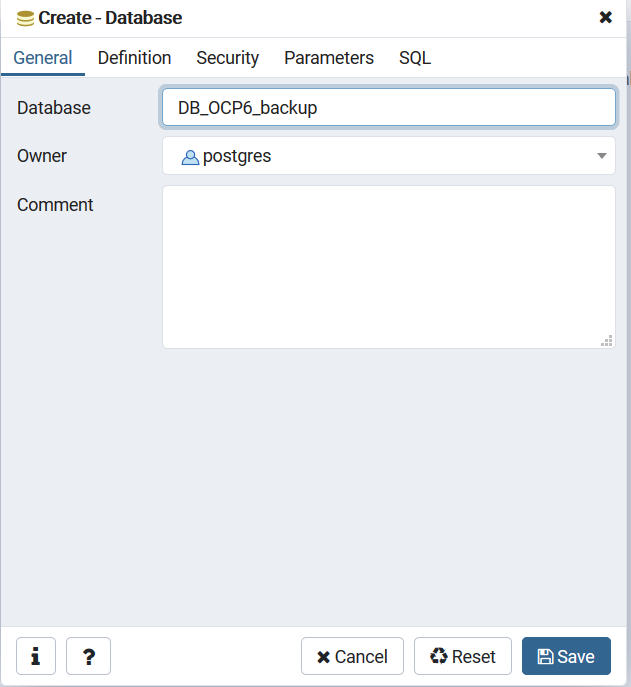

- Copier/Coller le contenu du fichier structure.sql dans le QueryEditor et executer le script
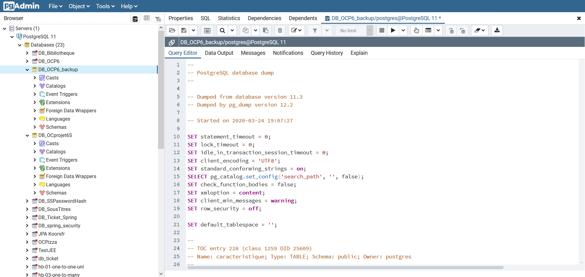

- Copier/Coller le contenu du fichier data.sql dans le QueryEditor et executer le script
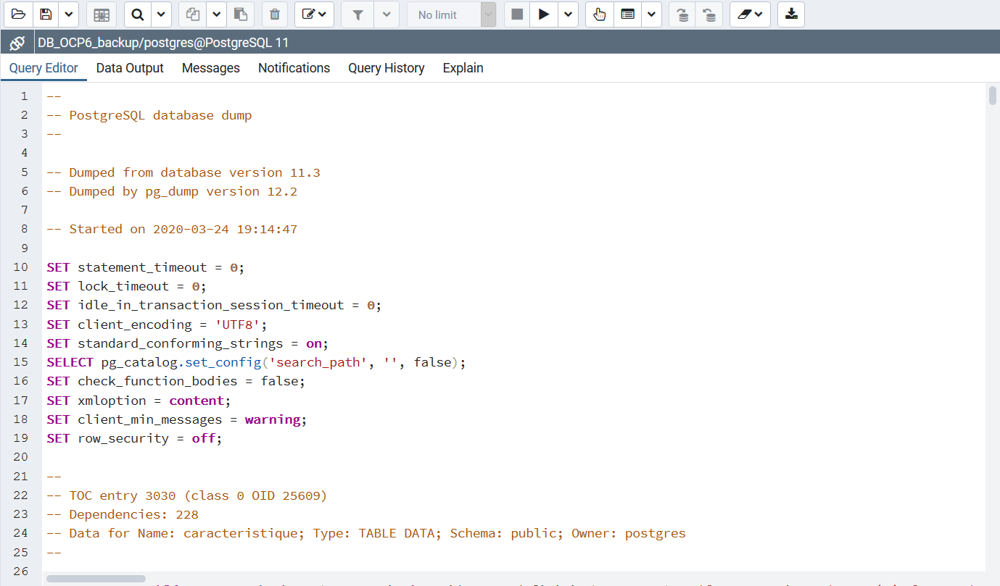

- Modifier url, username et password dans le fichier META-INF/context.xml si nécessaire
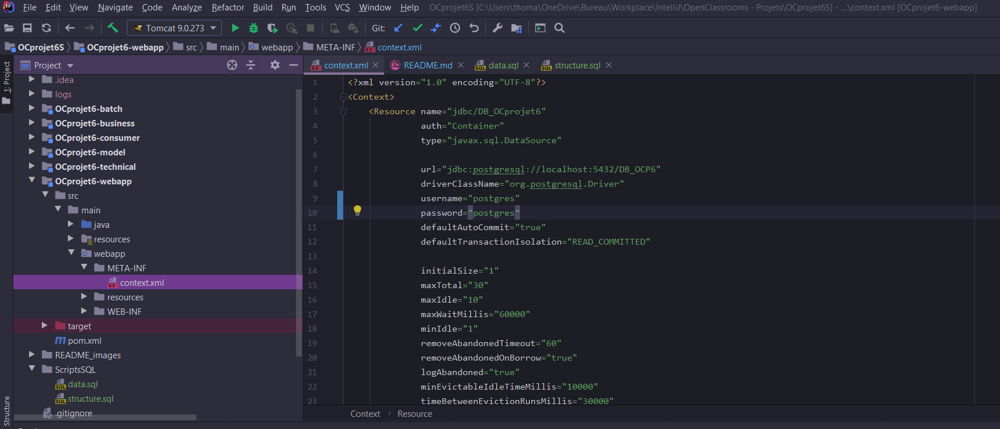

## Paramétrage du projet

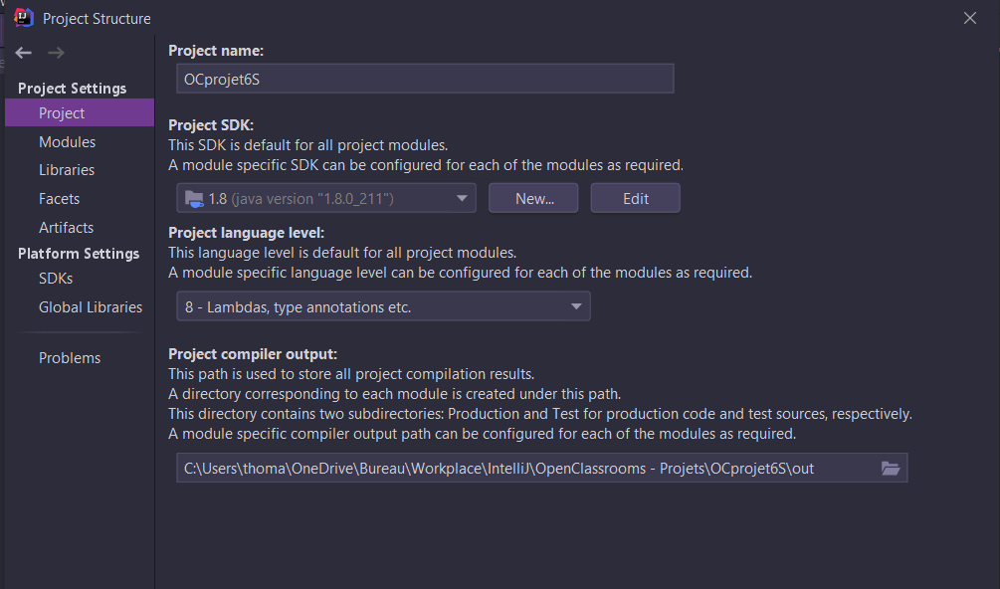
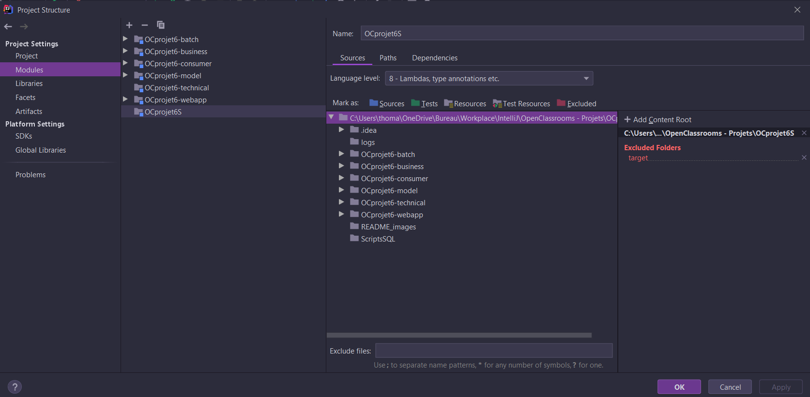
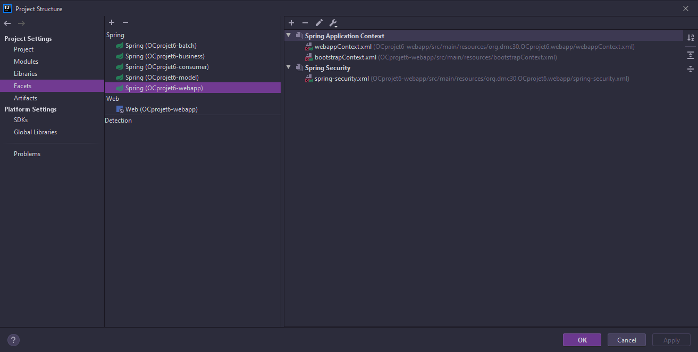
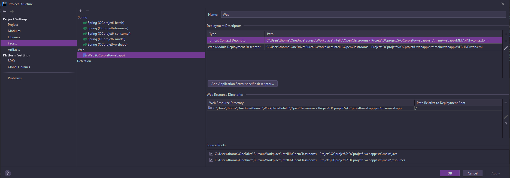
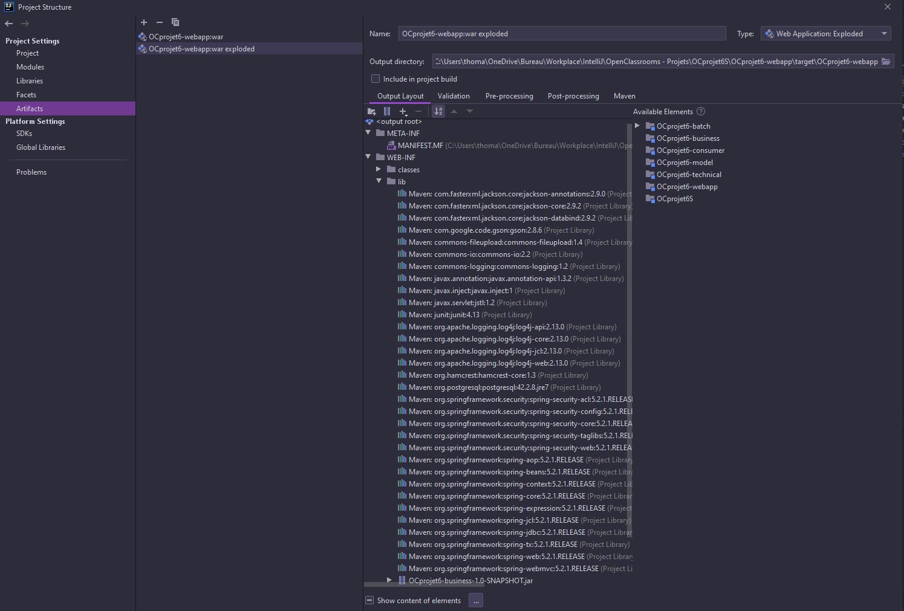

## Paramétrage de l'application web

- Ajouter une nouvelle configuration
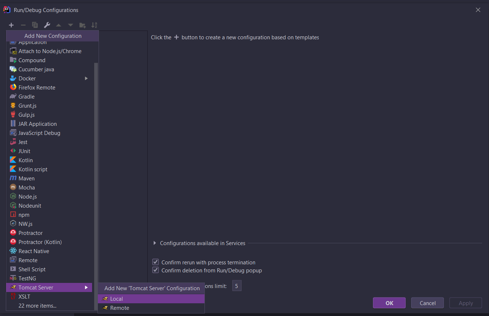
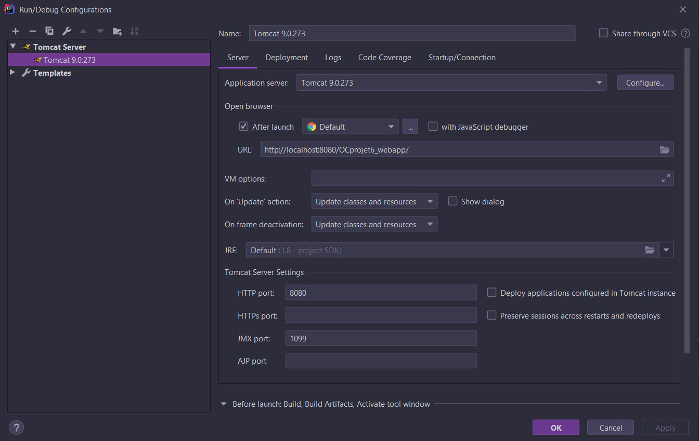
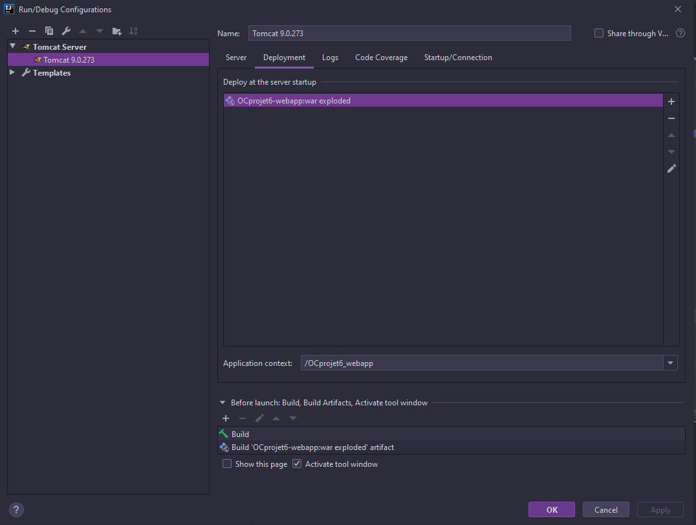